# simple_update_test
## Project Structure

```
simple_update_test/
├── assets/
    └── version.json
├── lib/
    ├── core/
    │   ├── config/
    │   │   ├── models/
    │   │   │   └── app_config.dart
    │   │   └── repositories/
    │   │   │   └── config_repository.dart
    │   ├── logging/
    │   │   ├── log_entry.dart
    │   │   ├── log_level.dart
    │   │   └── logger.dart
    │   └── version/
    │   │   ├── version_info.dart
    │   │   └── version_manager.dart
    ├── features/
    │   ├── setup/
    │   │   └── setup_manager.dart
    │   └── update/
    │   │   ├── providers/
    │   │       ├── update_service_notifier_provider.dart
    │   │       └── update_service_notifier_provider.g.dart
    │   │   ├── screens/
    │   │       └── update_checker_screen.dart
    │   │   ├── services/
    │   │       ├── provider/
    │   │       │   ├── counter_provider.dart
    │   │       │   └── counter_provider.g.dart
    │   │       └── update_service.dart
    │   │   └── widgets/
    │   │       └── version_display.dart
    └── main.dart
├── README.md
└── pubspec.yaml
```

## README.md
```md
# simple_update_test
 🔥 simple update test application for flutter windows app.


## build flow

```mermaid
flowchart TB
    Start([시작]) --> Init[초기 설정]
    Init --> Settings[/경로 설정/]
    Settings -->|"① Flutter 프로젝트 경로<br>② Hash-maker 경로<br>③ Updater 경로"| CheckPaths{경로 확인}
    
    CheckPaths -->|실패| Error1[경로 오류]
    Error1 --> End1([종료])
    
    CheckPaths -->|성공| BuildFlutter[Flutter Windows 빌드]
    BuildFlutter --> CheckBuild{빌드 성공?}
    
    CheckBuild -->|실패| Error2[빌드 오류]
    Error2 --> End2([종료])
    
    CheckBuild -->|성공| CopyUpdater[Updater 파일 복사]
    CopyUpdater --> SetZipName[ZIP 파일명 설정]
    
    SetZipName --> CustomName{사용자 지정<br>이름?}
    CustomName -->|있음| UseCustom[사용자 지정 이름 사용]
    CustomName -->|없음| UseDateTime[날짜/시간 기반 이름 생성]
    
    UseCustom --> GenHash[해시값 생성]
    UseDateTime --> GenHash
    
    GenHash --> CreateZip[ZIP 파일 생성]
    CreateZip --> FinalHash[최종 ZIP 해시 생성]
    
    FinalHash --> Success([완료])

    style Start fill:#e1f5fe
    style Success fill:#e8f5e9
    style End1 fill:#ffebee
    style End2 fill:#ffebee
```



## update flow


```
## assets/version.json
```json
{
    "version": "1.0.0",
    "buildDate": "2024-01-01",
    "versionString": "Flutter_APP_V1.0.0(2024-01-01)"
}
```
## lib/core/config/models/app_config.dart
```dart
class AppConfig {
  final String title;
  final String ip;
  final String name;
  final String? fromVersion;

  const AppConfig({
    required this.title,
    required this.ip,
    required this.name,
    this.fromVersion,
  });

  factory AppConfig.fromJson(Map<String, dynamic> json) {
    final profileList = json['profileList'] as List;
    final firstProfile = profileList.first as Map<String, dynamic>;

    return AppConfig(
      title: json['title'] ?? 'This is Flutter APP',
      ip: firstProfile['ip'] ?? 'http://localhost:8000',
      name: firstProfile['name'] ?? 'server',
      fromVersion: null,
    );
  }

  AppConfig copyWith({
    String? title,
    String? ip,
    String? name,
    String? fromVersion,
  }) {
    return AppConfig(
      title: title ?? this.title,
      ip: ip ?? this.ip,
      name: name ?? this.name,
      fromVersion: fromVersion ?? this.fromVersion,
    );
  }
}

```
## lib/core/config/repositories/config_repository.dart
```dart
import 'dart:convert';
import 'dart:io';

import 'package:path_provider/path_provider.dart';
import 'package:simple_update_test/core/logging/logger.dart';

import '../models/app_config.dart';

class ConfigRepository {
  static final ConfigRepository _instance = ConfigRepository._internal();
  factory ConfigRepository() => _instance;
  final _logger = Logger();

  ConfigRepository._internal();

  Future<String> get _localPath async {
    final docDir = await getApplicationDocumentsDirectory();
    final configDir = Directory("${docDir.path}\\.testfolder");

    if (!await configDir.exists()) {
      await configDir.create(recursive: true);
    }
    return configDir.path;
  }

  Future<File> get _configFile async {
    final path = await _localPath;
    return File("$path\\config.json");
  }

  Future<AppConfig> loadConfig() async {
    try {
      final file = await _configFile;
      if (!await file.exists()) {
        return const AppConfig(
          title: 'This is Flutter APP',
          ip: 'http://localhost:8000',
          name: 'server',
          fromVersion: null,
        );
      }

      final jsonString = await file.readAsString();
      final jsonMap = json.decode(jsonString);
      return AppConfig.fromJson(jsonMap);
    } catch (e, s) {
      _logger.error(e, s);
      return const AppConfig(
        title: 'This is Flutter APP',
        ip: 'http://localhost:8000',
        name: 'server',
        fromVersion: null,
      );
    }
  }

  Future<void> saveConfig(AppConfig config) async {
    final file = await _configFile;
    final jsonString = json.encode({
      'title': config.title,
      'profileList': [
        {
          'name': config.name,
          'ip': config.ip,
        }
      ]
    });
    await file.writeAsString(jsonString);
  }
}

```
## lib/core/logging/log_entry.dart
```dart
import 'package:intl/intl.dart';

import 'log_level.dart';

class LogEntry {
  final LogLevel level;
  final String message;
  final String callerInfo;
  final DateTime timestamp;

  LogEntry({
    required this.level,
    required this.message,
    required this.callerInfo,
  }) : timestamp = DateTime.now();

  String get formattedMessage {
    final dateFormat = DateFormat('yyyy-MM-dd HH:mm:ss');
    return '${dateFormat.format(timestamp)} [${level.name}] $callerInfo :: $message';
  }
}

```
## lib/core/logging/log_level.dart
```dart
enum LogLevel {
  debug,
  info,
  warn,
  error,
  fatal;

  String get name => toString().split('.').last.toUpperCase();
}

```
## lib/core/logging/logger.dart
```dart
import 'dart:async';
import 'dart:collection';
import 'dart:io';

import 'log_entry.dart';
import 'log_level.dart';

class Logger {
  static final Logger _instance = Logger._internal();
  static const int _maxConcurrentWrites = 5;

  final Map<String, IOSink> _logSinks = {};
  final Queue<LogEntry> _logQueue = Queue<LogEntry>();
  int _activeWrites = 0;
  Completer<void>? _processingCompleter;

  Logger._internal();

  factory Logger() => _instance;

  static String _getCallerInfo() {
    final frames = StackTrace.current.toString().split('\n');
    const framesToSkip = 3;
    if (frames.length > framesToSkip) {
      final frame = frames[framesToSkip];
      final regex = RegExp(r'#\d+\s+(.+) \((.+?):(\d+)(?::\d+)?\)');
      final match = regex.firstMatch(frame);
      if (match != null) {
        final method = match.group(1);
        final file = match.group(2)?.split('/').last;
        final line = match.group(3);
        return '[$file:$line] in $method';
      }
    }
    return '[Unknown location]';
  }

  void log({
    required LogLevel level,
    required String message,
    required String filePath,
  }) {
    final entry = LogEntry(
      level: level,
      message: message,
      callerInfo: _getCallerInfo(),
    );

    _logQueue.add(entry);
    _processQueue();
  }

  Future<void> _processLogEntry(LogEntry entry, String filePath) async {
    _activeWrites++;
    try {
      final sink = await _getLogSink(filePath);
      sink.writeln(entry.formattedMessage);
      await sink.flush();
    } catch (e) {
      print('Error writing log: $e');
    } finally {
      _activeWrites--;
      _processQueue();
    }
  }

  Future<IOSink> _getLogSink(String filePath) async {
    if (!_logSinks.containsKey(filePath)) {
      final file = File(filePath);
      await file.parent.create(recursive: true);
      _logSinks[filePath] = file.openWrite(mode: FileMode.append);
    }
    return _logSinks[filePath]!;
  }

  void _processQueue() {
    if (_processingCompleter != null) return;
    _processingCompleter = Completer<void>();

    Future<void> processNext() async {
      if (_logQueue.isEmpty) {
        _processingCompleter?.complete();
        _processingCompleter = null;
        return;
      }

      if (_activeWrites < _maxConcurrentWrites) {
        final entry = _logQueue.removeFirst();
        await _processLogEntry(entry, 'path_to_log_file.log'); // 실제 경로로 변경 필요
        processNext();
      }
    }

    processNext();
  }

  // 편의성 메서드들
  void debug(String message) =>
      log(level: LogLevel.debug, message: message, filePath: 'debug.log');
  void info(String message) =>
      log(level: LogLevel.info, message: message, filePath: 'info.log');
  void warn(String message) =>
      log(level: LogLevel.warn, message: message, filePath: 'warn.log');
  void error(Object error, StackTrace stackTrace) => log(
        level: LogLevel.error,
        message:
            "ERROR: ${error.toString()}\nSTACKTRACE: ${stackTrace.toString()}",
        filePath: 'error.log',
      );

  Future<void> dispose() async {
    while (_logQueue.isNotEmpty || _activeWrites > 0) {
      await _processingCompleter?.future;
    }
    for (var sink in _logSinks.values) {
      await sink.flush();
      await sink.close();
    }
    _logSinks.clear();
  }
}

```
## lib/core/version/version_info.dart
```dart
class VersionInfo {
  final String version;
  final String buildDate;
  final String versionString;

  const VersionInfo({
    required this.version,
    required this.buildDate,
    required this.versionString,
  });

  factory VersionInfo.fromJson(Map<String, dynamic> json) {
    return VersionInfo(
      version: json['version'] as String,
      buildDate: json['buildDate'] as String,
      versionString: json['versionString'] as String,
    );
  }

  Map<String, dynamic> toJson() {
    return {
      'version': version,
      'buildDate': buildDate,
      'versionString': versionString,
    };
  }
}

```
## lib/core/version/version_manager.dart
```dart
import 'package:flutter/material.dart';
import 'package:intl/intl.dart';

import 'version_info.dart';

class Version {
  final String s;
  final Color c;

  const Version({
    required this.s,
    required this.c,
  });

  factory Version.parse(String versionString) {
    return Version(
      s: versionString,
      c: Colors.blue,
    );
  }

  factory Version.fromVersionInfo(VersionInfo info) {
    return Version(
      s: info.versionString,
      c: Colors.blue,
    );
  }

  String get formattedVersion => s;
  String get updateVersion {
    final match = RegExp(r'Flutter_APP_(V\d+\.\d+\.\d+\(\d{4}-\d{2}-\d{2}\))')
        .firstMatch(s);
    return match?.group(1) ?? s;
  }

  Color get color => c;

  static bool isUpdateAvailable(String currentVersion, String latestVersion) {
    final currentMatch =
        RegExp(r'Flutter_APP_V(\d+\.\d+\.\d+)\((\d{4}-\d{2}-\d{2})\)')
            .firstMatch(currentVersion);
    final latestMatch =
        RegExp(r'Flutter_APP_V(\d+\.\d+\.\d+)\((\d{4}-\d{2}-\d{2})\)')
            .firstMatch(latestVersion);

    if (currentMatch == null || latestMatch == null) {
      return false;
    }

    final currentVersionNumber = currentMatch.group(1);
    final currentDate = DateFormat('yyyy-MM-dd').parse(currentMatch.group(2)!);
    final latestVersionNumber = latestMatch.group(1);
    final latestDate = DateFormat('yyyy-MM-dd').parse(latestMatch.group(2)!);

    if (latestVersionNumber != currentVersionNumber) {
      return latestVersionNumber!.compareTo(currentVersionNumber!) > 0;
    }

    return latestDate.isAfter(currentDate);
  }
}

```
## lib/features/setup/setup_manager.dart
```dart
import 'dart:convert';
import 'dart:io';

import 'package:args/args.dart';
import 'package:path/path.dart' as path;
import 'package:path_provider/path_provider.dart';

import '../../core/config/repositories/config_repository.dart';
import '../../core/logging/logger.dart';

class SetupManager {
  static final SetupManager _instance = SetupManager._internal();
  factory SetupManager() => _instance;

  SetupManager._internal();

  Future<void> initialize({
    required ArgParser parser,
    required List<String> args,
  }) async {
    final logger = Logger();
    try {
      final argResults = parser.parse(args);
      final isPatch = argResults['patch'];
      final fromVersion = argResults['fromVersion'];

      logger.info('Start setup - patch: $isPatch, fromVersion: $fromVersion');

      if (isPatch) {
        await _cleanupBackup();
      }

      if (fromVersion != null) {
        await _handleVersionUpgrade(fromVersion);
      }

      await _setupConfigFile();
    } catch (error, stackTrace) {
      logger.error(error, stackTrace);
    }
  }

  Future<void> _cleanupBackup() async {
    final tempDir = await getTemporaryDirectory();
    final backupPath = path.join(tempDir.path, 'ACRABACK');
    final backupDir = Directory(backupPath);

    if (await backupDir.exists()) {
      await backupDir.delete(recursive: true);
      Logger().info('Backup folder deleted: $backupPath');
    }
  }

  Future<void> _handleVersionUpgrade(String fromVersion) async {
    // 기존 설정 불러오기
    final configRepo = ConfigRepository();
    final currentConfig = await configRepo.loadConfig();

    // fromVersion 정보 추가
    final updatedConfig = currentConfig.copyWith(
      fromVersion: fromVersion,
    );

    // 업데이트된 설정 저장
    await configRepo.saveConfig(updatedConfig);
  }

  Future<void> _setupConfigFile() async {
    try {
      final docDir = await getApplicationDocumentsDirectory();
      final testDir = Directory(path.join(
        docDir.path,
        Platform.pathSeparator,
        '..',
        Platform.pathSeparator,
        '.testfolder',
      ));

      // 디렉토리가 없으면 생성
      if (!await testDir.exists()) {
        await testDir.create(recursive: true);
      }

      final configFile = File(path.join(testDir.path, 'config.json'));

      // 새로운 설정 파일이 필요한 경우 생성
      if (!await configFile.exists()) {
        final defaultConfig = {
          "title": "Default Title",
          "profileList": [
            {
              "name": "server1",
              "ip": "http://localhost:8000",
            },
            {
              "name": "server2",
              "ip": "http://localhost:8000",
            }
          ]
        };

        await configFile.writeAsString(json.encode(defaultConfig));
        Logger().info('Created new config file at ${configFile.path}');
      }

      // 설정 로드 및 검증
      final configRepo = ConfigRepository();
      final config = await configRepo.loadConfig();
      Logger().info('Loaded config with title: ${config.title}');
    } catch (error, stackTrace) {
      Logger().error(error, stackTrace);
      throw Exception('Failed to setup config file: $error');
    }
  }
}

```
## lib/features/update/providers/update_service_notifier_provider.dart
```dart
import 'package:riverpod_annotation/riverpod_annotation.dart';
import 'package:simple_update_test/features/update/services/update_service.dart';

part 'update_service_notifier_provider.g.dart';

@riverpod
class UpdateServiceNotifier extends _$UpdateServiceNotifier {
  @override
  Future<UpdateService> build() async {
    final service = UpdateService();
    await Future.delayed(const Duration(milliseconds: 100)); // 초기화를 위한 지연
    return service;
  }
}

```
## lib/features/update/providers/update_service_notifier_provider.g.dart
```dart
// GENERATED CODE - DO NOT MODIFY BY HAND

part of 'update_service_notifier_provider.dart';

// **************************************************************************
// RiverpodGenerator
// **************************************************************************

String _$updateServiceNotifierHash() =>
    r'6c589855a169c0abb2088f515c54be3dae53ac1d';

/// See also [UpdateServiceNotifier].
@ProviderFor(UpdateServiceNotifier)
final updateServiceNotifierProvider = AutoDisposeAsyncNotifierProvider<
    UpdateServiceNotifier, UpdateService>.internal(
  UpdateServiceNotifier.new,
  name: r'updateServiceNotifierProvider',
  debugGetCreateSourceHash: const bool.fromEnvironment('dart.vm.product')
      ? null
      : _$updateServiceNotifierHash,
  dependencies: null,
  allTransitiveDependencies: null,
);

typedef _$UpdateServiceNotifier = AutoDisposeAsyncNotifier<UpdateService>;
// ignore_for_file: type=lint
// ignore_for_file: subtype_of_sealed_class, invalid_use_of_internal_member, invalid_use_of_visible_for_testing_member, deprecated_member_use_from_same_package

```
## lib/features/update/screens/update_checker_screen.dart
```dart
import 'dart:io';

import 'package:flutter/material.dart';
import 'package:flutter_riverpod/flutter_riverpod.dart';
import 'package:simple_update_test/features/update/providers/update_service_notifier_provider.dart';
import 'package:simple_update_test/features/update/services/provider/counter_provider.dart';

import '../../../core/config/models/app_config.dart';
import '../../../core/config/repositories/config_repository.dart';
import '../services/update_service.dart';

class UpdateCheckerScreen extends ConsumerStatefulWidget {
  const UpdateCheckerScreen({super.key});

  @override
  ConsumerState<ConsumerStatefulWidget> createState() =>
      _UpdateCheckerScreenState();
}

class _UpdateCheckerScreenState extends ConsumerState<UpdateCheckerScreen> {
  String _updateStatus = 'Click to check for updates';
  late AppConfig _appConfig;

  @override
  void initState() {
    super.initState();
    _loadConfig();
  }

  Future<void> _loadConfig() async {
    final configRepo = ConfigRepository();
    _appConfig = await configRepo.loadConfig();
    setState(() {});
  }

  @override
  Widget build(BuildContext context) {
    final count = ref.watch(counterProvider);
    final updateServiceAsyncValue = ref.watch(updateServiceNotifierProvider);

    return updateServiceAsyncValue.when(
      loading: () => const Scaffold(
        body: Center(child: CircularProgressIndicator()),
      ),
      error: (err, stack) => Scaffold(
        body: Center(child: Text('Error: $err')),
      ),
      data: (data) {
        return Scaffold(
          backgroundColor: data.currentVersion?.color,
          appBar: AppBar(
            backgroundColor: Colors.grey,
            title: Text("${_appConfig.title} - ${_appConfig.name}"),
          ),
          body: Center(
            child: Column(
              mainAxisAlignment: MainAxisAlignment.center,
              children: [
                Text(_updateStatus),
                Container(
                  margin: const EdgeInsets.symmetric(vertical: 10),
                  child: Text(
                    _appConfig.fromVersion != null
                        ? "version: ${_appConfig.fromVersion} to ${data.currentVersion?.formattedVersion}"
                        : "version: ${data.currentVersion?.formattedVersion}",
                  ),
                ),
                ElevatedButton(
                  onPressed: () async {
                    await _checkForUpdates(data);
                  },
                  child: const Text('Check for Updates'),
                ),
                const SizedBox(height: 20),
                // 카운터 UI 추가
                Text(
                  '현재 카운트: $count',
                  style: Theme.of(context).textTheme.headlineSmall,
                ),
                Row(
                  mainAxisAlignment: MainAxisAlignment.center,
                  children: [
                    ElevatedButton(
                      onPressed: () =>
                          ref.read(counterProvider.notifier).decrement(),
                      child: const Text('-'),
                    ),
                    const SizedBox(width: 20),
                    ElevatedButton(
                      onPressed: () =>
                          ref.read(counterProvider.notifier).increment(),
                      child: const Text('+'),
                    ),
                  ],
                ),
              ],
            ),
          ),
        );
      },
    );
  }

  Future<void> _checkForUpdates(UpdateService updateService) async {
    setState(() {
      _updateStatus = 'Checking for updates...';
    });

    try {
      final updateAvailable = await updateService.checkForUpdates(_appConfig);

      setState(() {
        if (updateAvailable) {
          _updateStatus =
              'Update available: ${updateService.latestVersion?.formattedVersion}';
          _startUpdate(updateService);
        } else {
          _updateStatus = 'You have the latest version';
        }
      });
    } catch (e) {
      setState(() {
        _updateStatus = 'Error checking for updates: $e';
      });
    }
  }

  Future<void> _startUpdate(UpdateService updateService) async {
    try {
      await updateService.startUpdate();
      await Future.delayed(const Duration(seconds: 1));
      exit(0);
    } catch (e) {
      setState(() {
        _updateStatus = 'Error starting update: $e';
      });
    }
  }
}

```
## lib/features/update/services/provider/counter_provider.dart
```dart
import 'package:riverpod_annotation/riverpod_annotation.dart';

part 'counter_provider.g.dart';

@riverpod
class Counter extends _$Counter {
  @override
  int build() {
    return 0;
  }

  void increment() {
    state = state + 1;
  }

  void decrement() {
    state = state - 1;
  }
}

```
## lib/features/update/services/provider/counter_provider.g.dart
```dart
// GENERATED CODE - DO NOT MODIFY BY HAND

part of 'counter_provider.dart';

// **************************************************************************
// RiverpodGenerator
// **************************************************************************

String _$counterHash() => r'5c84212a676392b8eeb5db0516f417143d5b3b07';

/// See also [Counter].
@ProviderFor(Counter)
final counterProvider = AutoDisposeNotifierProvider<Counter, int>.internal(
  Counter.new,
  name: r'counterProvider',
  debugGetCreateSourceHash:
      const bool.fromEnvironment('dart.vm.product') ? null : _$counterHash,
  dependencies: null,
  allTransitiveDependencies: null,
);

typedef _$Counter = AutoDisposeNotifier<int>;
// ignore_for_file: type=lint
// ignore_for_file: subtype_of_sealed_class, invalid_use_of_internal_member, invalid_use_of_visible_for_testing_member, deprecated_member_use_from_same_package

```
## lib/features/update/services/update_service.dart
```dart
import 'dart:convert';
import 'dart:io';

import 'package:ffi/ffi.dart';
import 'package:flutter/material.dart';
import 'package:flutter/services.dart';
import 'package:http/http.dart' as http;
import 'package:path/path.dart' as path;
import 'package:simple_update_test/core/config/models/app_config.dart';
import 'package:simple_update_test/core/logging/logger.dart';
import 'package:simple_update_test/core/version/version_info.dart';
import 'package:simple_update_test/core/version/version_manager.dart';
import 'package:win32/win32.dart';

class UpdateService {
  Version? _currentVersion; // nullable로 변경
  Version? _latestVersion;
  final Logger _logger = Logger();

  static final UpdateService _instance = UpdateService._internal();

  factory UpdateService() => _instance;
  UpdateService._internal() {
    _loadCurrentVersion();
  }

  Future<void> initialize() async {
    await _loadCurrentVersion();
  }

  Future<void> _loadCurrentVersion() async {
    try {
      final jsonString = await rootBundle.loadString('assets/version.json');
      final json = jsonDecode(jsonString);
      final versionInfo = VersionInfo.fromJson(json);
      _currentVersion = Version.fromVersionInfo(versionInfo);
      _logger.info('Loaded version: ${_currentVersion?.formattedVersion}');
    } catch (e, stackTrace) {
      _logger.error(e, stackTrace);
      // 폴백 버전 설정
      _currentVersion = const Version(
        s: "Flutter_APP_V1.0.0(2024-01-01)",
        c: Colors.blue,
      );
    }
  }

  Version? get currentVersion => _currentVersion; // nullable로 변경
  Version? get latestVersion => _latestVersion;

  Future<bool> checkForUpdates(AppConfig config) async {
    final serverUrl = '${config.ip}/update/updatefilename';

    try {
      final response = await http.get(Uri.parse(serverUrl));

      if (response.statusCode == 200) {
        final jsonResponse = json.decode(response.body);
        if (jsonResponse.containsKey('filename')) {
          final latestVersion = jsonResponse['filename'];
          _latestVersion = Version.parse(latestVersion);
          return Version.isUpdateAvailable(
            _currentVersion!.formattedVersion,
            _latestVersion!.formattedVersion,
          );
        }
      }
      return false;
    } catch (e, stackTrace) {
      _logger.error(e, stackTrace);
      return false;
    }
  }

  Future<void> startUpdate() async {
    final updaterPath = path.join(Directory.current.path, 'dupdater.exe');

    if (!await File(updaterPath).exists()) {
      throw Exception('Cannot find updater at: $updaterPath');
    }

    _logger.info('Launching updater...');
    final args = "-fromVersion ${_currentVersion!.updateVersion}";

    final result = _launchUpdaterWithElevation(
      updaterPath: updaterPath,
      args: args,
    );

    if (result != 0) {
      throw Exception('Failed to launch updater. Error code: $result');
    }

    // updater 실행 후 앱 종료를 위한 지연
    await Future.delayed(const Duration(seconds: 1));
    exit(0); // 앱 프로세스 종료
  }

  int _launchUpdaterWithElevation({
    required String updaterPath,
    required String args,
  }) {
    final lpFile = updaterPath.toNativeUtf16();
    final lpParameters = args.toNativeUtf16();
    final lpDirectory = Directory.current.path.toNativeUtf16();

    try {
      final result = ShellExecute(
        NULL,
        TEXT('runas'),
        lpFile,
        lpParameters,
        lpDirectory,
        SHOW_WINDOW_CMD.SW_HIDE,
      );

      return result > 32 ? 0 : result;
    } finally {
      free(lpFile);
      free(lpParameters);
      free(lpDirectory);
    }
  }
}

```
## lib/features/update/widgets/version_display.dart
```dart
import 'package:flutter/material.dart';

class VersionDisplay extends StatelessWidget {
  final String? currentVersion;
  final String targetVersion;

  const VersionDisplay({
    super.key,
    required this.currentVersion,
    required this.targetVersion,
  });

  @override
  Widget build(BuildContext context) {
    return Container(
      margin: const EdgeInsets.symmetric(vertical: 10),
      child: Text(
        currentVersion != null
            ? "version: $currentVersion to $targetVersion"
            : "version: $targetVersion",
      ),
    );
  }
}

```
## lib/main.dart
```dart
import 'package:args/args.dart';
import 'package:flutter/material.dart';
import 'package:flutter_riverpod/flutter_riverpod.dart';

import 'features/setup/setup_manager.dart';
import 'features/update/screens/update_checker_screen.dart';

void main(List<String> args) async {
  WidgetsFlutterBinding.ensureInitialized();

  final parser = ArgParser()
    ..addFlag('patch', abbr: 'p', defaultsTo: false, help: 'patch mode')
    ..addOption('fromVersion',
        abbr: 'f', defaultsTo: null, help: 'From Update Version');

  // 초기 설정
  await SetupManager().initialize(parser: parser, args: args);

  runApp(const ProviderScope(child: MyApp()));
}

class MyApp extends StatelessWidget {
  const MyApp({super.key});

  @override
  Widget build(BuildContext context) {
    return MaterialApp(
      title: 'Update Checker',
      theme: ThemeData(
        colorScheme: ColorScheme.fromSeed(seedColor: Colors.blue),
        useMaterial3: true,
      ),
      home: const UpdateCheckerScreen(),
    );
  }
}

```
## pubspec.yaml
```yaml
name: simple_update_test
description: "A new Flutter project."

publish_to: "none"

version: 1.0.0+1

environment:
  sdk: ">=3.4.4 <4.0.0"

dependencies:
  args: ^2.5.0
  cupertino_icons: ^1.0.6
  ffi: ^2.1.3
  flutter:
    sdk: flutter
  flutter_riverpod: ^2.6.1
  http: ^1.2.2
  intl: ^0.19.0
  path: ^1.9.0
  path_provider: ^2.1.4
  riverpod_annotation: ^2.6.1
  win32: ^5.5.4
dev_dependencies:
  build_runner: ^2.4.8
  flutter_lints: ^3.0.0
  flutter_test:
    sdk: flutter
  riverpod_generator: ^2.4.4
  riverpod_lint: ^2.4.0

flutter:
  uses-material-design: true

  assets:
    - assets/version.json

```
