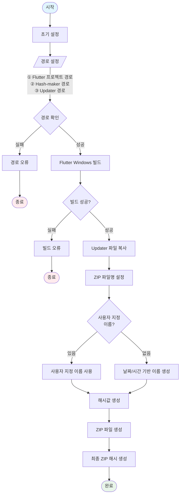
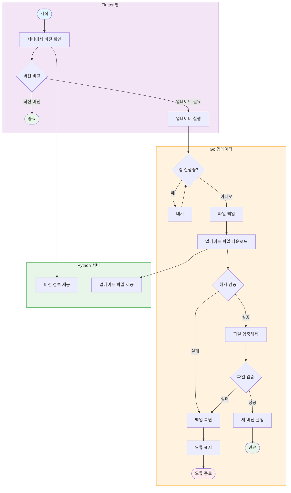

# simple_update_test
 🔥 simple update test application for flutter windows app

## build flow

```mermaid
flowchart TB
    Start([시작]) --> Init[초기 설정]
    Init --> Settings[/경로 설정/]
    Settings -->|"① Flutter 프로젝트 경로<br>② Hash-maker 경로<br>③ Updater 경로"| CheckPaths{경로 확인}
    
    CheckPaths -->|실패| Error1[경로 오류]
    Error1 --> End1([종료])
    
    CheckPaths -->|성공| BuildFlutter[Flutter Windows 빌드]
    BuildFlutter --> CheckBuild{빌드 성공?}
    
    CheckBuild -->|실패| Error2[빌드 오류]
    Error2 --> End2([종료])
    
    CheckBuild -->|성공| CopyUpdater[Updater 파일 복사]
    CopyUpdater --> SetZipName[ZIP 파일명 설정]
    
    SetZipName --> CustomName{사용자 지정<br>이름?}
    CustomName -->|있음| UseCustom[사용자 지정 이름 사용]
    CustomName -->|없음| UseDateTime[날짜/시간 기반 이름 생성]
    
    UseCustom --> GenHash[해시값 생성]
    UseDateTime --> GenHash
    
    GenHash --> CreateZip[ZIP 파일 생성]
    CreateZip --> FinalHash[최종 ZIP 해시 생성]
    
    FinalHash --> Success([완료])

    style Start fill:#e1f5fe
    style Success fill:#e8f5e9
    style End1 fill:#ffebee
    style End2 fill:#ffebee
```

## update flow

```mermaid
flowchart TB
    subgraph Flutter["Flutter 앱"]
        Start([시작]) --> CheckVer[서버에서 버전 확인]
        CheckVer --> CompareVer{버전 비교}
        CompareVer -->|최신 버전| End([종료])
        CompareVer -->|업데이트 필요| LaunchUpdater[업데이터 실행]
    end

    subgraph Updater["Go 업데이터"]
        LaunchUpdater --> CheckApp{앱 실행중?}
        CheckApp -->|예| Wait[대기]
        Wait --> CheckApp
        
        CheckApp -->|아니오| Backup[파일 백업]
        Backup --> Download[업데이트 파일 다운로드]
        Download --> VerifyHash{해시 검증}
        
        VerifyHash -->|실패| RestoreBackup[백업 복원]
        RestoreBackup --> ShowError[오류 표시]
        ShowError --> ErrorEnd([오류 종료])
        
        VerifyHash -->|성공| Extract[파일 압축해제]
        Extract --> VerifyFiles{파일 검증}
        
        VerifyFiles -->|실패| RestoreBackup
        VerifyFiles -->|성공| LaunchNew[새 버전 실행]
        LaunchNew --> Success([완료])
    end

    subgraph Server["Python 서버"]
        VersionAPI[버전 정보 제공]
        UpdateAPI[업데이트 파일 제공]
    end

    CheckVer --> VersionAPI
    Download --> UpdateAPI

    style Start fill:#e1f5fe
    style Success fill:#e8f5e9
    style ErrorEnd fill:#ffebee
    style End fill:#e8f5e9
    
    style Flutter fill:#f3e5f5,stroke:#9c27b0
    style Updater fill:#fff3e0,stroke:#ff9800
    style Server fill:#e8f5e9,stroke:#4caf50
```